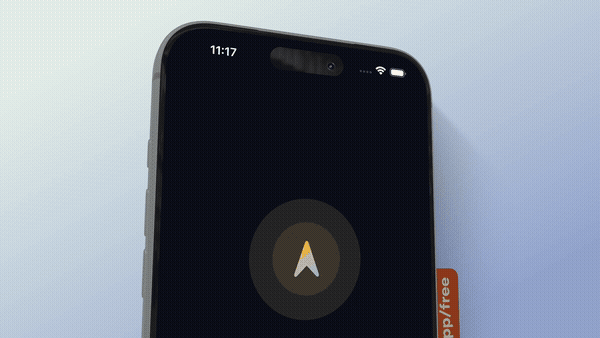
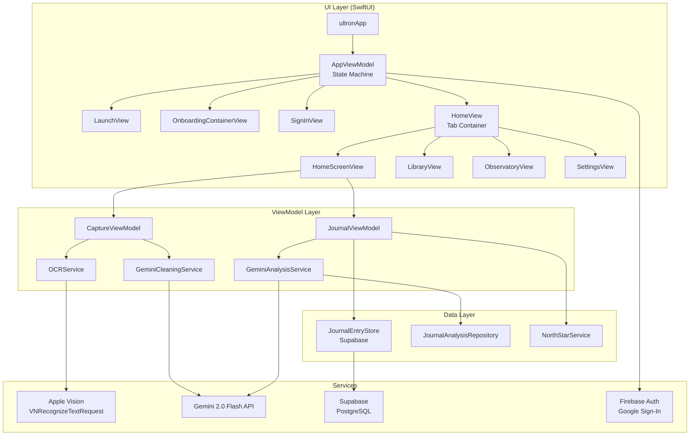
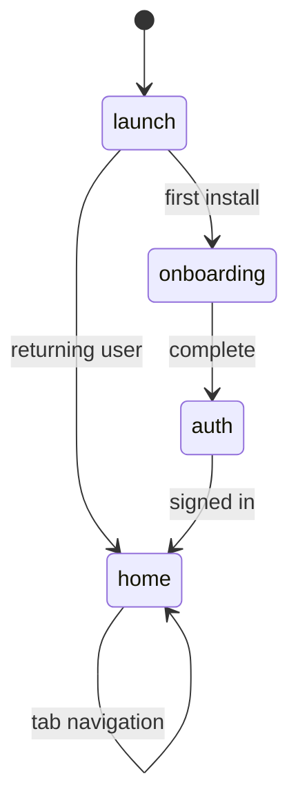
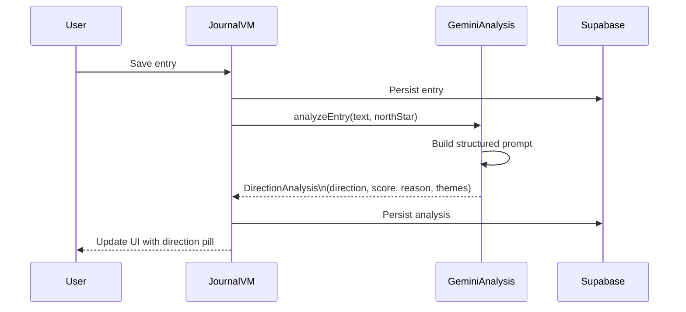
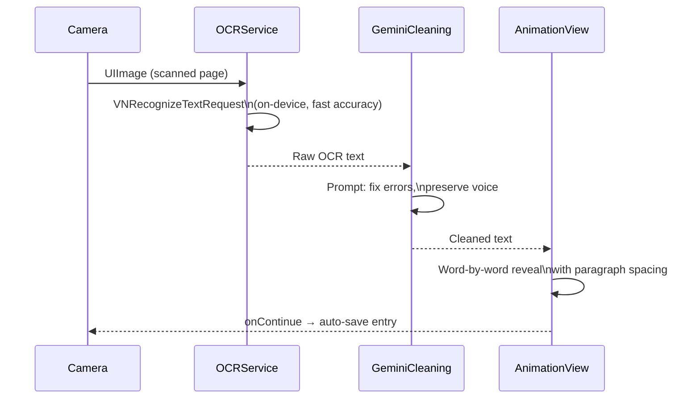

<div align="center">


# Compass

### AI-Powered iOS Journaling · Know where you're going.

[](https://developer.apple.com/ios/)
[](https://swift.org)
[](https://developer.apple.com/xcode/swiftui/)
[](https://developer.apple.com/xcode/)
[](https://firebase.google.com)
[](https://deepmind.google/technologies/gemini/)
[](LICENSE)

<br/>

> Most journaling apps give you a blank page. **Compass gives you a direction.**

</div>

---

## What is Compass?

Compass is a production iOS journaling app that fuses **handwriting capture**, **on-device OCR**, and **Gemini AI** to give every journal entry a measurable outcome against your long-term goal — your *North Star*.

Write a typed entry or scan a handwritten page. Compass extracts your words via Apple Vision, cleans them with Gemini, and re-types them word-by-word onto a notebook page in real time. Every entry is then analyzed: are you moving *toward* your North Star, staying *neutral*, or drifting *away*? Compass scores it, explains why, and coaches you back on track.

---

## Demo

<p align="center">
  
</p>

> *Full walkthrough video coming soon.*

---

## Features

| Feature | Description |
|---|---|
| **Write** | Rich journal entries with mood, title, tags, and rotating AI-generated prompts |
| **Capture** | Scan handwritten pages → Apple Vision OCR → Gemini cleanup → animated word-by-word reveal |
| **North Star** | Set one long-term goal. Every entry is scored against it |
| **AI Reflection** | Gemini 2.0 Flash returns direction, alignment score, coaching advice, and themes |
| **Observatory** | Mood trend charts, AI insights, and alignment history across any time window |
| **Library** | Timeline, On This Day, and Favorites views with full-text search |
| **Compass Monument** | Lighthouse animation that loads your latest AI guidance inline |
| **Campfire** | Writing streak tracker with weekly mood visualization |
| **Reflection Garden** | Gratitude counter with spring bloom animation |
| **Museum** | Curated Lessons, Quotes, and Memories gallery |
| **Themes** | Dark · Soft Cream · Midnight · OLED Black · System |
| **Notifications** | Morning reminder, evening reflection, weekly check-in, motivational quotes |
| **Achievements** | Milestone system rewarding consistency and reflection depth |

---

## Architecture

Compass follows **MVVM + Repository pattern** with a unidirectional state machine for app-level navigation.



### App State Machine



---

## AI Pipeline

### Entry Analysis



### Handwriting Capture Pipeline



---

## Tech Stack

| Layer | Technology | Purpose |
|---|---|---|
| **UI** | SwiftUI 5 | Declarative UI, animations, navigation |
| **Language** | Swift 5.9 | Async/await concurrency throughout |
| **AI Analysis** | Gemini 2.0 Flash | Entry direction analysis, coaching |
| **AI Cleaning** | Gemini 2.0 Flash | OCR text correction, voice preservation |
| **OCR** | Apple Vision (`VNRecognizeTextRequest`) | On-device handwriting recognition |
| **Auth** | Firebase Auth + Google Sign-In | Secure user authentication |
| **Database** | Supabase (PostgreSQL) | Journal entries, analyses, user data |
| **Video** | AVFoundation (`AVPlayerItemVideoOutput`) | Alpha-channel mascot animation |
| **GIF Playback** | WKWebView | Frame-accurate animated GIF rendering |
| **Notifications** | `UNUserNotificationCenter` | Scheduled local notifications |
| **Persistence** | `AppStorage` + Supabase | Settings + cloud sync |

---

## Folder Structure

```
ultron/
├── ultronApp.swift              # App entry point, DI injection
├── ContentView.swift            # Root view router
│
├── Models/                      # Pure value types (Codable)
│   ├── JournalEntry.swift
│   ├── DirectionAnalysis.swift
│   ├── Mood.swift / MoodRecord.swift
│   ├── Milestone.swift / Achievement.swift
│   └── ...
│
├── ViewModels/                  # ObservableObject business logic
│   ├── AppViewModel.swift       # App-level state machine
│   ├── AppSessionState.swift    # In-memory session flags
│   ├── JournalViewModel.swift   # Entry CRUD + AI trigger
│   ├── JournalEntryStore.swift  # Supabase data layer
│   ├── GeminiAnalysisService.swift   # Entry AI analysis
│   ├── GeminiCleaningService.swift   # OCR text cleanup
│   ├── NorthStarService.swift   # Goal persistence
│   ├── ThemeManager.swift
│   ├── SettingsManager.swift
│   └── NotificationManager.swift
│
├── Views/                       # SwiftUI screens by feature
│   ├── Home/                    # HomeView, HomeScreenView
│   ├── Capture/                 # Camera, OCR, animation flow
│   ├── Library/                 # Timeline, On This Day, Favorites
│   ├── Observatory/             # Charts, insights
│   ├── Onboarding/              # North Star setup
│   ├── Settings/                # Profile, appearance, notifications
│   └── ...
│
├── Features/
│   └── Authentication/          # Sign in, sign up, Google auth
│
├── Components/                  # Reusable SwiftUI views
│   ├── GlassCard.swift
│   ├── GIFPlayerView.swift      # WKWebView GIF renderer
│   ├── MoodSelector.swift
│   └── ...
│
├── Theme/
│   └── AppTheme.swift           # Colors, typography, spacing
│
└── Assets.xcassets/             # Images, colors, data assets
```

---

## Requirements

| | Minimum |
|---|---|
| iOS | 17.0 |
| Xcode | 15.4 |
| Swift | 5.9 |
| macOS (dev) | Sonoma 14.0+ |

---

## Installation

**1. Clone the repository**

```bash
git clone https://github.com/Ninja-cloud-sorce/ultron.git
cd ultron
open ultron.xcodeproj
```

**2. Create `Config.plist`**

Create `ultron/Config.plist` with the following keys. This file is gitignored — never commit it.

```xml
<?xml version="1.0" encoding="UTF-8"?>
<!DOCTYPE plist PUBLIC "-//Apple//DTD PLIST 1.0//EN" "http://www.apple.com/DTDs/PropertyList-1.0.dtd">
<plist version="1.0">
<dict>
    <key>FIREBASE_GOOGLE_APP_ID</key>      <string>YOUR_VALUE</string>
    <key>FIREBASE_GCM_SENDER_ID</key>      <string>YOUR_VALUE</string>
    <key>FIREBASE_CLIENT_ID</key>          <string>YOUR_VALUE</string>
    <key>FIREBASE_API_KEY</key>            <string>YOUR_VALUE</string>
    <key>FIREBASE_PROJECT_ID</key>         <string>YOUR_VALUE</string>
    <key>FIREBASE_STORAGE_BUCKET</key>     <string>YOUR_VALUE</string>
    <key>GEMINI_API_KEY</key>              <string>YOUR_VALUE</string>
</dict>
</plist>
```

**3. Run**

Select a simulator (iPhone 15 or later recommended) and press `⌘R`.

> **Demo mode:** If `Config.plist` is missing, Firebase auth is disabled and AI features return graceful fallbacks. The app is fully navigable without credentials.

---

## Engineering Decisions

### Why Gemini 2.0 Flash for OCR cleanup?
Flash's low latency (~600ms) makes it viable for an interactive capture flow. The prompt is structured to preserve the user's original voice and sentence structure while correcting only OCR artifacts — a nuance that smaller models miss.

### Why WKWebView for GIF playback?
`UIImage.animatedImage` uses a fixed-timer loop that drops frames on large GIFs. WKWebView delegates rendering to the same WebKit engine as Safari — hardware-accelerated, frame-accurate, and memory-efficient even for 7MB assets.

### Why AVPlayerItemVideoOutput for the mascot?
`VideoPlayer` and `AVPlayerLayer` both composite video as opaque, stripping the alpha channel. `AVPlayerItemVideoOutput` pulls raw `CVPixelBuffer` frames via a `CADisplayLink`, allowing manual `CIImage → CGImage → UIImage` conversion that preserves transparency.

### Why a custom state machine over NavigationStack paths?
The app has three distinct root states (onboarding, auth, home) that cannot be represented as a simple navigation path. A `@Published var appState: AppState` enum in `AppViewModel` gives each state its own root view and clear transition logic.

---

## Performance

- **OCR** runs on a background thread via `VNImageRequestHandler`; results are dispatched to `@MainActor` only for UI updates
- **Gemini calls** use Swift `async/await` — no Combine, no callbacks, no retain cycles
- **Mascot video** invalidates its `CADisplayLink` immediately on finish to prevent runaway CPU usage
- **`MascotView`** shows the static PNG on subsequent session visits — the video plays only once per cold launch using `AppSessionState`
- **Entry analysis** is triggered asynchronously post-save and does not block the write path

---

## Security

| Concern | Mitigation |
|---|---|
| API keys | Stored in `Config.plist` (gitignored), never in source |
| Firebase credentials | `GoogleService-Info.plist` gitignored |
| User data | Supabase row-level security — users access only their own rows |
| Auth tokens | Managed by Firebase SDK; not stored manually |
| OCR processing | Apple Vision runs fully on-device — no image leaves the device |

---

## Roadmap

- [ ] **iCloud sync** — Offline-first with CloudKit fallback
- [ ] **Widget** — Today's North Star alignment score on the home screen
- [ ] **Siri Shortcuts** — "Add journal entry" voice action
- [ ] **Share Sheet** — Export entries as styled PDFs
- [ ] **Apple Watch** — Quick mood log from wrist
- [ ] **FoundationModels** — On-device analysis using Apple Intelligence (iOS 26+)
- [ ] **Streak sharing** — Share Campfire milestones to social

---

## Release Notes

**v1.0** — July 2026
- Initial release
- North Star onboarding with Gemini goal clarification
- Write and Capture entry flows
- Gemini 2.0 Flash analysis pipeline
- Observatory, Library, Museum, Campfire, Reflection Garden, Compass Monument
- 5 themes, 4 notification types, Achievements system

---

## License

MIT License © 2026 Praful — see [LICENSE](LICENSE) for details.

---

<div align="center">

Built with SwiftUI · Gemini AI · Apple Vision · Firebase · Supabase

**[@Ninja-cloud-sorce](https://github.com/Ninja-cloud-sorce)**

</div>
