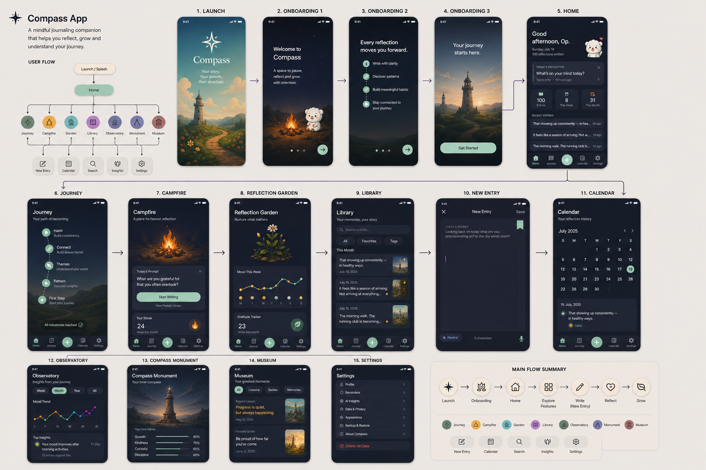
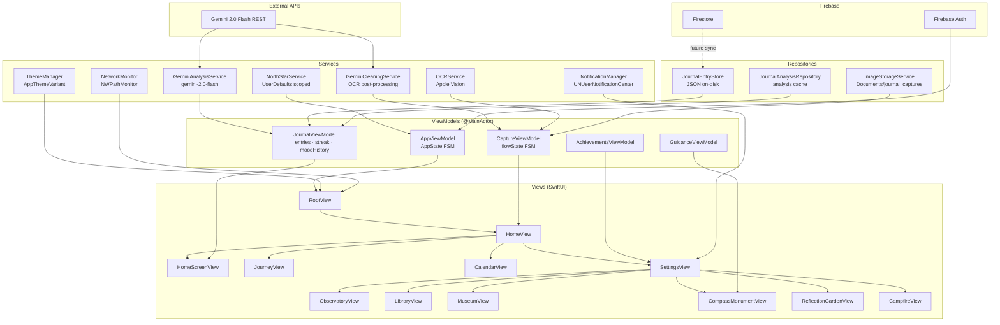
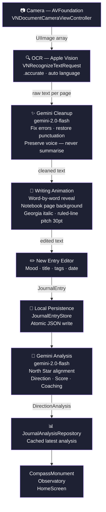

<div align="center">

<br />


<h1>Compass</h1>

<p><strong>An AI-powered journaling experience that keeps you moving toward who you want to become.</strong></p>

<br />

[](https://swift.org)
[](https://developer.apple.com/xcode/swiftui/)
[](https://developer.apple.com/ios/)
[](https://firebase.google.com)
[](https://ai.google.dev)
[](#architecture)
[](LICENSE)

<br />

[**View Demo**](#demo-video) · [**Architecture**](#architecture) · [**Installation**](#installation) · [**Roadmap**](#roadmap)

</div>

---

## Preview

<div align="center">

<!-- Drop your demo GIF below -->


</div>

<br />

<div align="center">

| Home | Observatory | Capture | Compass Monument |
|:----:|:-----------:|:-------:|:---------------:|
|  |  |  |  |
| *North Star greeting + quick write* | *Mood trends + AI insights* | *Scan → OCR → AI cleanup → animation* | *Lighthouse guidance hub* |

| Library | Campfire | Reflection Garden | Journey |
|:-------:|:--------:|:-----------------:|:-------:|
|  |  |  |  |
| *Timeline · On This Day · Favorites* | *Streaks + mood chart* | *Gratitude tracker + bloom animation* | *Milestone map with curved paths* |

</div>

---

## Why Compass?

Most journaling apps ask you to write. Compass asks you *why.*

Generic apps give you a blank page. They capture words, but miss meaning. They have no idea who you're trying to become — so every entry sits in isolation, disconnected from the life you're building.

**Compass is built around a single idea:** your journal should know your North Star.

Set a long-term goal — *"Become an iOS Engineer"*, *"Build something people love"* — and every entry you write is analyzed against it. Are you moving **toward** it? **Holding steady?** Or **drifting away?** Not as a judgment, but as a signal. A compass needle.

The writing experience itself is designed to feel unhurried. Scan your handwritten pages and watch your words re-emerge — one word at a time — onto a ruled notebook page, as if being written by memory. The OCR pipeline doesn't rewrite you; it restores you.

---

## Features

### ✍️ Writing
- Inline journal editor with mood selection, title, tags, and date backfill
- **Prompt cards** to break writer's block on difficult days
- Bookmark entries for later revisiting in the Library

### 🤖 AI
- **Gemini 2.0 Flash** analyzes every entry against your North Star
- Returns an **alignment score (0–100)** and direction: *Toward · Neutral · Away*
- Generates coaching recommendations, thematic tags, and AI clarification suggestions
- Graceful degradation to mock analysis when offline or API key absent

### 📸 Capture (OCR Pipeline)
- Document camera scanner powered by **AVFoundation** — supports multi-page capture
- **Apple Vision** (`VNRecognizeTextRequest`) with `.accurate` recognition level and auto language detection
- **Gemini OCR cleanup** — fixes recognition errors, restores punctuation, preserves your exact vocabulary and tone
- Full-screen **notebook writing animation** — cleaned text types itself word-by-word onto a ruled page background
- Edit cleaned text before saving, or accept as-is

### 📖 Reading (Library)
- **Timeline** — entries grouped by month, newest-first
- **On This Day** — entries from this calendar date in past years
- **Favorites** — bookmarked entries, instantly filterable
- Full-text search across title, body, and tags

### 📊 Observatory
- Mood trend line chart (Week / Month / Year / All)
- Top AI-surfaced insights from your entry history
- Alignment score history per time window

### 🏛️ Museum
- Curated repository of your best **Lessons**, **Quotes**, and **Memories**
- Tab-filtered by type, with a styled quote card layout

### 🌸 Reflection Garden
- Gratitude entry counter with spring bloom animation (scales from 0.35→1.0 with damping)
- Weekly mood chart inline
- Serene, growth-oriented visual space

### 🔥 Campfire
- Daily writing streak tracker
- Mood chart across the current week
- Designed for consistency — no pressure, just presence

### 🏔️ Compass Monument
- Lighthouse hero animation — tap to activate the beam
- Beam shoots down from the lighthouse peak while Gemini loads
- **Guidance reveal** — AI coaches you on your latest alignment
- North Star alignment pill shows direction at a glance

### 🗺️ Journey
- Milestone map — curved Bézier connectors between achievements
- Milestones: Campfire, Library, Compass Monument, First Step
- Animated staggered reveal on scroll

### 🔔 Notifications
- **Morning reminder** — user-configurable time (default 08:00)
- **Evening reflection** — fixed 21:00 check-in
- **Weekly reflection** — Sunday at 19:00
- **Motivational quotes** — 5 rotating quote notifications
- Reschedules on every launch to survive reinstalls and reboots

### 🏆 Achievements
- **First Journal** — write your first entry
- **North Star Set** — define your long-term goal
- **7-Day Streak** — write for 7 consecutive days
- **Reflection Explorer** — complete an AI reflection

### 🎨 Appearance
Five hand-crafted themes — tap to apply live:

| Theme | Background | Personality |
|-------|-----------|-------------|
| **Dark** | `#0D0F1A` | Easy on the eyes |
| **Soft Cream** | `#F6F2EA` | Warm journal paper |
| **Midnight** | `#080812` | Deep focus mode |
| **OLED Black** | `#000000` | Pure black display |
| **System** | iOS default | Follows iOS setting |

### 🔐 Authentication
- Firebase Auth with **Google Sign-In** and **Apple Sign-In**
- Guest/skip mode — full app access without an account
- Auth state listener kicks back to sign-in on session expiry

### 📡 Offline
- Local-first: all entries stored in a per-user JSON file on device
- Network monitor overlays an error view when offline — no silent failures
- Gemini calls fall back to mock analysis gracefully

---

## User Journey

```
Open App
    │
    ▼
Launch Screen
    │
    ▼
Landing  ──────────────────────┐
    │                          │
    ▼                          │
Onboarding (3 pages)           │
    │                          │
    ▼                          │
Sign In / Skip ────────────────┘
    │
    ▼
North Star Setup
  "What do you want to become?"
    │
    ▼
Home
  ├── Write  ────────► New Entry Editor ────► AI Analysis ────► Direction Score
  ├── Capture ─────► Camera ──► OCR ──► Gemini Cleanup ──► Writing Animation ──► Editor
  ├── Journey ─────► Milestone Map
  ├── Calendar ────► Day View
  └── Settings
        ├── Observatory ──► Mood Charts + Insights
        ├── Library ──────► Timeline · On This Day · Favorites
        ├── Museum ───────► Lessons · Quotes · Memories
        ├── Campfire ─────► Streak + Mood
        ├── Reflection Garden ──► Gratitude + Mood
        └── Compass Monument ──► Lighthouse + AI Guidance
```

---

## Architecture

Compass is built on a clean MVVM + Repository foundation with unidirectional data flow.



> [!NOTE]
> All `@MainActor` ViewModels ensure UI updates happen on the main thread. Services are actor-isolated or thread-safe by design. Firebase Firestore sync is architected but currently behind a future flag.

---

## AI Pipeline

The full OCR → AI → animation pipeline, step by step:



> [!TIP]
> Every stage degrades gracefully. OCR failure returns an empty string. Gemini cleanup failure returns the raw OCR text unchanged. Gemini analysis failure returns a mock `DirectionAnalysis`. The user is never blocked.

---

## Folder Structure

```
ultron/
├── ultronApp.swift              # App entry — Firebase init, environment injection, notification reschedule
├── ContentView.swift            # RootView — AppState switch + network error overlay
│
├── Features/
│   └── Authentication/          # Firebase Auth, Google Sign-In, Apple Sign-In, SignUpCardView
│
├── Views/
│   ├── Home/                    # HomeView + HomeScreenView + ClarificationSheet
│   ├── Capture/                 # CaptureSheet · CaptureScanner · OCRService
│   │                            # CaptureViewModel · JournalWritingAnimationView
│   │                            # GeminiCleaningService · ImageStorageService
│   ├── NewEntry/                # NewEntryView — inline editor
│   ├── Library/                 # LibraryView — Timeline · On This Day · Favorites · Search
│   ├── Observatory/             # ObservatoryView — mood chart + insights
│   ├── Museum/                  # MuseumView — Lessons · Quotes · Memories
│   ├── Campfire/                # CampfireView — streak + mood history
│   ├── ReflectionGarden/        # ReflectionGardenView — gratitude + bloom animation
│   ├── CompassMonument/         # CompassMonumentView · LighthouseHero
│   │                            # BeaconAnimation · GuidanceCard
│   ├── Journey/                 # JourneyView — milestone map + curved Bézier connectors
│   ├── Calendar/                # CalendarView — day-level entry browser
│   ├── Settings/                # SettingsView + AISettingsView + AppearanceView
│   │                            # NotificationsView · AchievementsView · BackupView
│   │                            # JournalPreferencesView · ProfileEditView · PrivacyView
│   ├── Onboarding/              # OnboardingContainerView · NorthStarView
│   ├── Landing/                 # LandingView
│   ├── Launch/                  # LaunchView
│   └── NetworkErrorView.swift   # Offline overlay
│
├── ViewModels/
│   ├── AppViewModel.swift        # AppState FSM · auth listener · tab selection
│   ├── JournalViewModel.swift    # Entry CRUD · streak · mood history · AI trigger
│   ├── CaptureViewModel.swift    # Capture flow FSM (idle → processing → animating)
│   ├── GuidanceViewModel.swift   # Compass Monument AI guidance
│   ├── AchievementsViewModel.swift # Achievement unlock logic
│   ├── GeminiAnalysisService.swift # Gemini 2.0 Flash — direction analysis
│   ├── GeminiCleaningService.swift # Gemini 2.0 Flash — OCR post-processing
│   ├── AIAnalysisService.swift   # AIAnalysisProvider protocol + MockAIAnalysisService
│   ├── EmbeddingService.swift    # EmbeddingProvider protocol (future vector search)
│   ├── NorthStarService.swift    # North Star goal persistence (UserDefaults scoped)
│   ├── NotificationManager.swift # UNUserNotificationCenter — 4 notification types
│   ├── ThemeManager.swift        # 5-theme live switching
│   ├── NetworkMonitor.swift      # NWPathMonitor — published connection state
│   ├── JournalEntryStore.swift   # Atomic JSON file persistence (per-user scoped)
│   ├── JournalAnalysisRepository.swift # Latest analysis cache
│   ├── SettingsManager.swift     # User preferences
│   ├── AppSessionState.swift     # Cross-view session state
│   └── UserContext.swift         # Per-user UID data scoping
│
├── Models/
│   ├── JournalEntry.swift        # Core data model — written + captured entries
│   ├── DirectionAnalysis.swift   # AI analysis result — direction · score · coaching
│   ├── Mood.swift                # 7 mood states with emoji, color, icon
│   ├── MoodRecord.swift          # Mood + date for chart rendering
│   ├── Achievement.swift         # Gamification model
│   ├── CoreValue.swift           # User values (future)
│   ├── Guidance.swift            # Compass Monument guidance payload
│   ├── Insight.swift             # Observatory insight cards
│   ├── LibraryItem.swift         # Library display model
│   ├── Milestone.swift           # Journey milestone
│   ├── MuseumMemory.swift        # Museum memory/lesson/quote
│   ├── ReflectionPrompt.swift    # Writing prompt cards
│   └── ClarificationSuggestion.swift # AI sentence clarification
│
├── Components/
│   ├── GlassCard.swift           # Frosted glass card — used throughout
│   ├── GlowButton.swift          # Primary CTA button with glow shadow
│   ├── MoodLineChart.swift       # Custom SwiftUI mood trend line chart
│   ├── BarGraph.swift            # Bar chart component
│   ├── AlignmentChartView.swift  # Alignment score visualization
│   ├── JournalEntryCard.swift    # Entry preview card
│   ├── MuseumCard.swift          # Museum memory card
│   ├── MilestoneCard.swift       # Journey milestone card
│   ├── MoodSelector.swift        # 7-mood horizontal selector
│   ├── SearchBar.swift           # In-list search input
│   ├── FilterChip.swift          # Pill-shaped filter toggle
│   ├── StatCard.swift            # Stats summary card
│   ├── TimeFilterPicker.swift    # Week / Month / Year / All segmented picker
│   ├── SectionHeader.swift       # Consistent section header
│   ├── PromptCard.swift          # Writing prompt card
│   ├── BackgroundImageView.swift # Ambient background helper
│   └── ViewExtensions.swift      # SwiftUI View modifiers
│
├── Theme/
│   └── AppTheme.swift            # Design tokens — Colors · Spacing · Radius · Typography
│
└── Assets.xcassets/             # App icons · images (campire · flower png · page bg · mascot)
```

---

## Tech Stack

| Layer | Technology | Purpose |
|-------|-----------|---------|
| **UI** | SwiftUI 5 | Declarative UI with custom animations |
| **Navigation** | Custom AppState FSM | Controlled state machine — no NavigationStack fragility |
| **AI Analysis** | Gemini 2.0 Flash (REST) | Entry alignment scoring, coaching, theme extraction |
| **OCR Cleanup** | Gemini 2.0 Flash (REST) | Post-process Vision output, preserve author voice |
| **OCR** | Apple Vision (`VNRecognizeTextRequest`) | On-device handwriting and printed text recognition |
| **Auth** | Firebase Auth | Email, Google, Apple Sign-In + session management |
| **Database** | Firestore (architected) | Cloud sync foundation |
| **Local Storage** | JSON file (atomic write) | Offline-first, per-user scoped |
| **Notifications** | `UNUserNotificationCenter` | Morning · Evening · Weekly · Quotes |
| **Networking** | `NWPathMonitor` | Real-time connectivity monitoring |
| **Concurrency** | Swift Concurrency (async/await) | All async work — no callback pyramids |
| **Architecture** | MVVM + Repository | Separated concerns, testable ViewModels |
| **Embeddings** | Protocol-first placeholder | Ready for vector search (Gemini / Supabase pgvector / Pinecone) |
| **Theming** | ThemeManager + AppTheme tokens | 5 themes, live switching via `.id(theme)` |
| **Privacy** | Apple PrivacyInfo.xcprivacy | App Store privacy manifest |

---

## Engineering Decisions

**Why a custom AppState FSM instead of NavigationStack?**
Compass has a gated onboarding flow with auth that can be bypassed, a North Star setup screen that only appears once, and an auth listener that can eject the user from anywhere in the app. NavigationStack push/pop semantics don't model this cleanly. A state machine in `AppViewModel` — with explicit `.launch → .landing → .onboarding → .auth → .northStar → .home` transitions — makes every path explicit and testable.

**Why Gemini 2.0 Flash over a larger model?**
Analysis runs on every save — latency matters. Flash returns structured JSON in under 2 seconds, fits within the cost envelope of a free-tier personal project, and handles the constrained prompt format (journal text + North Star → `DirectionAnalysis`) with sufficient accuracy. The protocol abstraction (`AIAnalysisProvider`) means swapping to a larger model is a one-line change.

**Why a separate `GeminiCleaningService` instead of embedding cleanup in the analysis prompt?**
OCR cleanup and direction analysis have different quality requirements. Cleanup needs temperature 0.1 and strict instruction-following ("never summarise, preserve voice"). Analysis needs temperature 0.4 with creative coaching suggestions. Merging them risks prompt interference. Two focused prompts are cleaner and independently tunable.

**Why Apple Vision for OCR instead of a cloud service?**
On-device processing means journal content never leaves the device during capture. The Vision framework supports handwriting, printed text, and mixed content with `.accurate` recognition and automatic language detection — no API key, no round-trip latency, no privacy tradeoff. Gemini cleanup then fixes the residual errors in a second pass.

**Why per-user UID data scoping via `UserContext`?**
A single device may be shared or re-used across accounts. Scoping all UserDefaults keys and file paths to the authenticated UID prevents data leakage between accounts after sign-out. This is enforced at the storage layer — no View needs to be aware of it.

**Why an `EmbeddingProvider` protocol with a no-op placeholder?**
Vector search is the natural next step — semantic memory retrieval, "find entries similar to this one", LLM-powered coaching grounded in journal history. Building the protocol now means Gemini Embeddings, Supabase pgvector, or Pinecone can be wired in without touching a single ViewModel.

---

## Performance

**Background processing** — All file I/O, Gemini API calls, and analysis persistence happen in Swift Concurrency Tasks. The UI never blocks.

**Incremental mutation** — `_entryDateSet` (used for streak calculation) is updated incrementally on every `addEntry` / `deleteEntry`. No full-array recompute on every streak read.

**Stable IDs in ForEach** — `LibraryMonthGroup` uses the month-year label string as its stable ID instead of `UUID()`. This prevents SwiftUI from treating every recompute as a full list replacement and eliminates phantom bookmark-toggle animation flickers.

**Lazy loading** — Library and Observatory use `ScrollView` + `LazyVStack` equivalents; heavy views are deferred until visible.

**Atomic writes** — All journal persistence uses `.atomicWrite` — the file is never left in a half-written state if the app is killed mid-save.

**Theme switching** — Applying `.id(theme.activeTheme.rawValue)` to the root view forces SwiftUI to rebuild the view tree on theme change, ensuring every token resolves against the new theme without manual color propagation.

**API key safety** — Gemini and Firebase credentials are loaded at runtime from `Config.plist` (not checked into the repo). Both services gracefully degrade when keys are absent — OCR cleanup returns raw text; analysis returns mock data.

---

## Demo Video

<div align="center">

> **Promo video** — showing the full capture → OCR → writing animation → AI analysis flow

<!-- Embed or link your promo video here -->
<a href="ultron/reference/mascot_transparent_3s.mov">
  
</a>

*Click to watch the walkthrough*

</div>

---

## Installation

> [!IMPORTANT]
> Compass uses Firebase and Gemini — both require API keys that are **not** stored in the repository. Follow the steps below to configure your own environment.

### Prerequisites

- Xcode 15.4+
- iOS 17+ device or simulator
- A [Firebase](https://console.firebase.google.com) project with Auth + Firestore enabled
- A [Google AI Studio](https://aistudio.google.com) API key (Gemini)

### Steps

**1. Clone the repository**

```bash
git clone https://github.com/Ninja-cloud-sorce/ultron.git
cd ultron
```

**2. Create `Config.plist`**

In Xcode, create a new Property List file at `ultron/Config.plist` and add the following keys:

```xml
<?xml version="1.0" encoding="UTF-8"?>
<!DOCTYPE plist PUBLIC "-//Apple//DTD PLIST 1.0//EN" "...">
<plist version="1.0">
<dict>
    <!-- Firebase -->
    <key>FIREBASE_GOOGLE_APP_ID</key>
    <string>YOUR_GOOGLE_APP_ID</string>
    <key>FIREBASE_GCM_SENDER_ID</key>
    <string>YOUR_GCM_SENDER_ID</string>
    <key>FIREBASE_CLIENT_ID</key>
    <string>YOUR_CLIENT_ID</string>
    <key>FIREBASE_API_KEY</key>
    <string>YOUR_FIREBASE_API_KEY</string>
    <key>FIREBASE_PROJECT_ID</key>
    <string>YOUR_PROJECT_ID</string>
    <key>FIREBASE_STORAGE_BUCKET</key>
    <string>YOUR_STORAGE_BUCKET</string>
    <!-- Gemini -->
    <key>GEMINI_API_KEY</key>
    <string>YOUR_GEMINI_API_KEY</string>
</dict>
</plist>
```

> [!WARNING]
> Never commit `Config.plist`. It is already listed in `.gitignore`.

**3. Configure Firebase**

- Enable **Email/Password**, **Google**, and **Apple** sign-in methods in the Firebase console
- Copy your `GoogleService-Info.plist` values into `Config.plist` (the app reads from Config at runtime — do not add the raw plist)

**4. Open in Xcode**

```bash
open ultron.xcodeproj
```

**5. Set your Team + Bundle ID**

In Xcode → Signing & Capabilities, select your development team and update the bundle identifier.

**6. Run**

Select a simulator or device and press `⌘R`.

> [!NOTE]
> If `Config.plist` is missing or incomplete, the app starts normally. Firebase is not configured (auth is disabled), and AI features fall back to mock data. You can explore the full UI without any keys.

---

## Roadmap

| Status | Feature |
|--------|---------|
| ✅ | North Star goal setting and onboarding |
| ✅ | AI direction analysis (Gemini 2.0 Flash) |
| ✅ | OCR capture with writing animation |
| ✅ | 5 themes with live switching |
| ✅ | Streak tracking and achievements |
| ✅ | Observatory mood charts |
| ✅ | Library (Timeline · On This Day · Favorites) |
| ✅ | 4-type notification system |
| ✅ | Museum, Campfire, Reflection Garden |
| ✅ | Compass Monument lighthouse guidance |
| 🔄 | Firestore real-time sync |
| 🔄 | iCloud Backup / Export |
| 🔄 | Semantic search via vector embeddings (Gemini text-embedding-004) |
| 🔄 | Widgets — streak and daily prompt |
| 🔄 | Apple Watch companion |
| 🔄 | Voice journaling with on-device transcription |
| 🔄 | Weekly AI reflection digest (email / push) |
| 🔄 | Shared themes / App Store launch |

---

## Repository Statistics

```
Language         Swift 100%
Architecture     MVVM + Repository Pattern
AI               Gemini 2.0 Flash (Analysis + OCR Cleanup)
OCR              Apple Vision (on-device)
Auth             Firebase Auth — Google · Apple · Email
Storage          Local JSON (atomic) + Firestore (architected)
Notifications    UNUserNotificationCenter — 4 channels
Themes           5 hand-crafted color palettes
Platform         iOS 17+  ·  SwiftUI 5
Views            16 distinct screens
ViewModels       17 @MainActor classes / actors
Models           13 data types
Components       17 reusable SwiftUI components
```

---

## Contributing

This is a personal portfolio project and is not open to external contributions at this time.

If you find a bug or want to share feedback, feel free to [open an issue](https://github.com/Ninja-cloud-sorce/ultron/issues).

---

## License

```
MIT License

Copyright (c) 2026 Ninja-cloud-sorce

Permission is hereby granted, free of charge, to any person obtaining a copy
of this software and associated documentation files (the "Software"), to deal
in the Software without restriction, including without limitation the rights
to use, copy, modify, merge, publish, distribute, sublicense, and/or sell
copies of the Software, and to permit persons to whom the Software is
furnished to do so, subject to the following conditions:

The above copyright notice and this permission notice shall be included in all
copies or substantial portions of the Software.

THE SOFTWARE IS PROVIDED "AS IS", WITHOUT WARRANTY OF ANY KIND, EXPRESS OR
IMPLIED, INCLUDING BUT NOT LIMITED TO THE WARRANTIES OF MERCHANTABILITY,
FITNESS FOR A PARTICULAR PURPOSE AND NONINFRINGEMENT. IN NO EVENT SHALL THE
AUTHORS OR COPYRIGHT HOLDERS BE LIABLE FOR ANY CLAIM, DAMAGES OR OTHER
LIABILITY, WHETHER IN AN ACTION OF CONTRACT, TORT OR OTHERWISE, ARISING FROM,
OUT OF OR IN CONNECTION WITH THE SOFTWARE OR THE USE OR OTHER DEALINGS IN THE
SOFTWARE.
```

---

<div align="center">

Built with focus, reflection, and a North Star.

</div>
